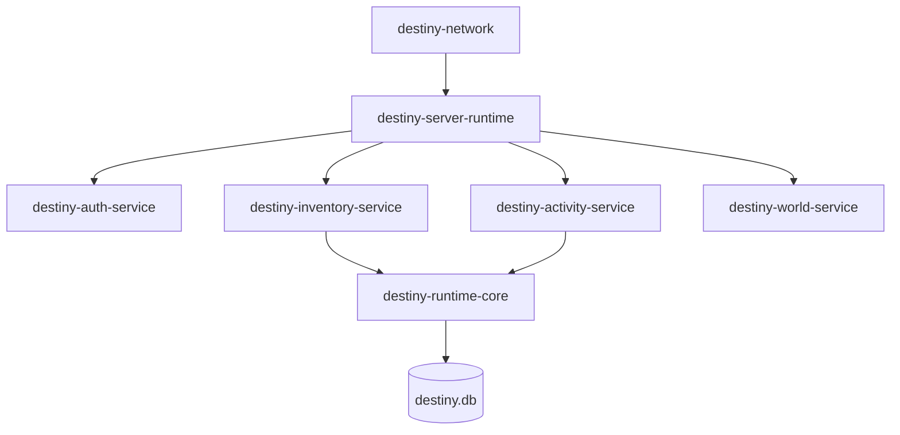

# Project Destiny

Content-signature-driven preservation indexer for extracted Destiny Tiger engine definition files.

```sh
cargo test
cargo run --release --bin destiny-index -- ./extracted_data
# writes destiny.db; use --output PATH to override
```

The parser intentionally records bounded header candidates and printable strings without claiming an unknown layout. Hashes are SHA-256. The schema reserves a references table for validated reference decoders as formats are learned.

## Runtime architecture

The workspace now contains read-only runtime and future-service boundaries:

`destiny-parser -> destiny.db -> destiny-runtime-core -> destiny-definition-api -> destiny-server-framework -> future RPCS3 adapter`

- `destiny-runtime-core` loads definitions, references, metadata, and preserved raw payloads with a mutex-protected cache.
- `destiny-definition-api` provides a minimal HTTP adapter: `/definition/{hash}`, `/references/{hash}`, and `/stats`.
- `destiny-server-framework` contains connection/session/player-state containers and placeholder services.
- `destiny-network` contains neutral packet/opcode research types. Unknown opcodes remain `None`.
- `destiny-storage` contains serializable player, inventory, character, and progression models.

Run the API with:

```sh
cargo run -p destiny-definition-api -- --database destiny.db --listen 127.0.0.1:8080
```

Protocol emulation, authentication, persistence backends, and RPCS3 compatibility are intentionally TODOs.

## Server framework status



Implemented: packet/session/state models, placeholder authentication sessions, inventory and activity containers, world-state containers, service composition, packet logging, and unknown-opcode handling.

Simulated: placeholder authentication accepts an explicitly supplied account, and service state is in memory.

Unknown: Destiny opcode values, message schemas, authentication wire protocol, matchmaking/world transitions, durable player persistence, and RPCS3 compatibility. These remain documented extension points and are not fabricated.
